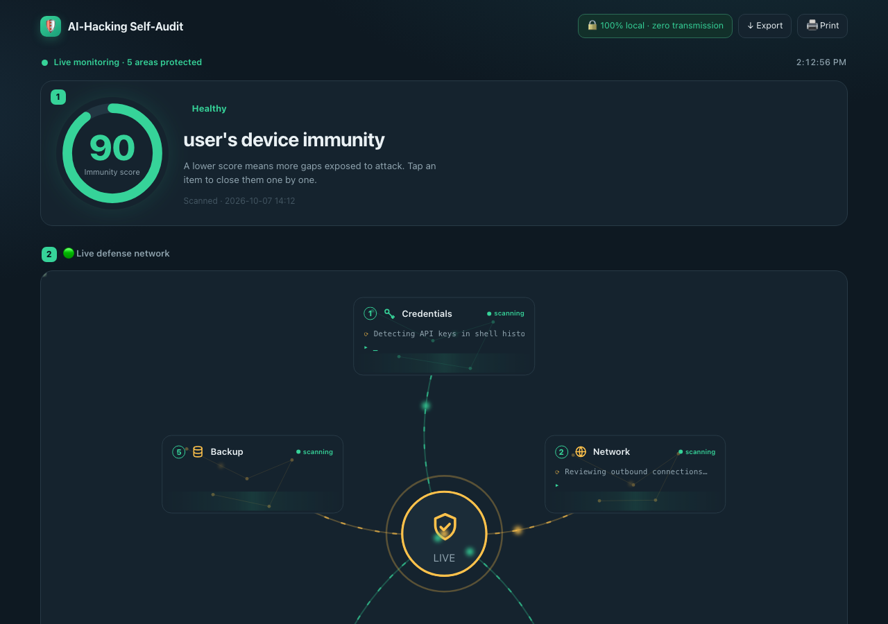

# Install Guide (English) — AI-Hacking Self-Audit

> A personal security self-audit that never sends a single byte off your machine. Install to first report in ~3 minutes.
> 한국어 가이드: [INSTALL.md](INSTALL.md)

## 1. Requirements
- Python 3.8+ (`python3 --version`)
- Zero other dependencies — standard library only.

## 2. Install

### Option A — pip (recommended)
```bash
pip install ai-hacking-defense
```

### Option B — from source
```bash
git clone https://github.com/ftlord7/ai-hacking-defense
cd ai-hacking-defense
pip install .
```

## 3. First scan
```bash
ai-hacking-defense --lang en
```
Two files appear in the current folder:
- `security_report.html` — open it in your browser (sample below)
- `scan_result.json` — same data as JSON



## 4. Open the report
```bash
open security_report.html        # macOS
# Windows: start security_report.html / Linux: xdg-open security_report.html
```

## 5. Platforms (honest note)
- **macOS**: all checks verified — fully supported today.
- **Windows / Linux**: checks have platform branches but are **not yet fully verified (experimental)**. Issue reports speed up official support.

## 6. Uninstall
```bash
pip uninstall ai-hacking-defense
```
Delete the two report files and nothing remains. The tool changes no settings and runs nothing in the background.

## If something breaks
[TROUBLESHOOTING.md](TROUBLESHOOTING.md) → still stuck? Run `ai-hacking-defense feedback` — it shows you the full payload first; you submit it yourself on GitHub.
